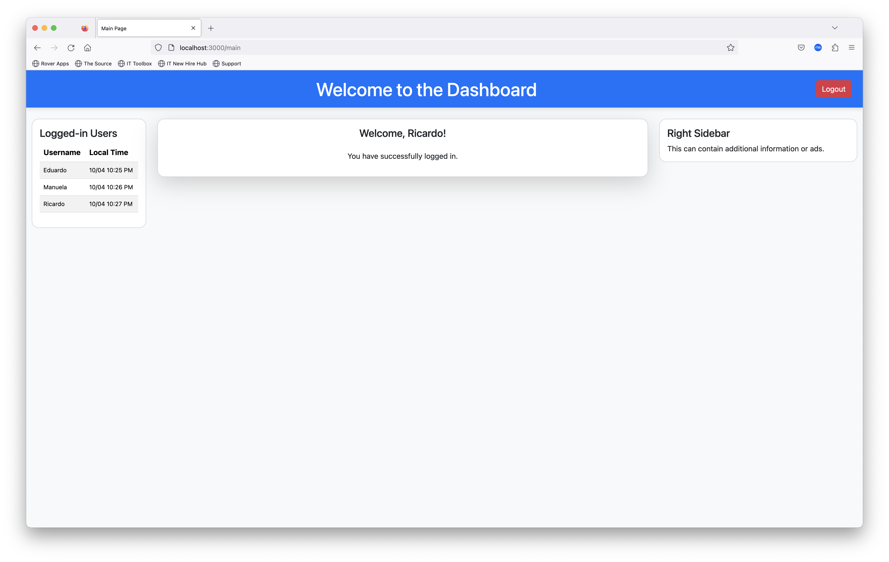

# Node.js Login Application

This is a basic login application built using **Node.js** with **Express**, **Express-session**, **Body-parser**, and **Bootstrap 5.3.3**. It allows users to log in with a username and displays all currently logged-in users along with their local times. The application features two main pages: a login page and a main dashboard page.

## Features

- **Login System**: Users can log in using a username, which is tracked through session cookies.
- **Session Management**: Sessions are handled using `express-session`, ensuring that users stay logged in across page reloads until they log out.
- **Display Logged-In Users**: A table in the left container of the dashboard lists all logged-in users along with their local times.
- **Auto-refresh**: The logged-in users' list is refreshed every 5 seconds.
- **Responsive Layout**: The main page layout is structured using Bootstrap, with a header, a left container for logged-in users, a center container for welcome messages, and a right container for additional content.
- **Logout Functionality**: Users can log out, which clears their session.



## Technologies Used

- **Node.js**: Server-side JavaScript environment
- **Express.js**: Web framework for Node.js
- **Express-session**: Middleware to handle session management
- **Body-parser**: Middleware to parse request bodies
- **Bootstrap 5.3.3**: Frontend framework for styling and layout
- **EJS**: Embedded JavaScript templates for rendering views

## Prerequisites

Ensure you have the following installed on your local machine:

- [Node.js](https://nodejs.org/) (v12.x or later)
- [npm](https://www.npmjs.com/) (usually installed with Node.js)

## Installation

1. **Clone the repository**:
    ```bash
    git clone https://github.com/eduardocerqueira/boostrap-express-app.git
    cd boostrap-express-app
    ```

2. **Install dependencies**:
    Run the following command to install all required npm packages:
    ```bash
    npm install
    ```

## Running the Application

1. **Start the server**:
    ```bash
    node app.js
    ```

2. Open your browser and go to `http://localhost:3000` to access the application.

## Running the application in container

Build container image and run the application:

```
docker build -t node-login-app .
docker run -p 3000:3000 -d node-login-app
```

-p 3000:3000 maps port 3000 on the host to port 3000 in the container.
-d runs the container in detached mode (in the background).

Open a browser and navigate to http://localhost:3000 to see your Node.js app running in the container.

## Development Mode
If you want to run the application in development mode (with automatic server restarts when files change), use:

```
npm run dev
```

This requires nodemon, which will automatically restart the server on code changes.

## Running Tests
This application uses Jest and Supertest for testing.

To run the tests, use the following command:

```
npm test
```
This will execute all tests located in the tests/ folder.

## Test Coverage
* Tests are written to verify login functionality.
* Tests include scenarios for successful login, and failure when a username is not provided.

## Application Structure

```
├── public
│   ├── css
│   │   ├── bootstrap.min.css  # Bootstrap CSS
│   │   └── custom.css         # Custom styles
├── views
│   ├── login.ejs              # Login page template
│   ├── main.ejs               # Main dashboard template
├── app.js                     # Main server-side application logic
├── package.json               # Node.js dependencies and scripts
├── Dockerfile                 # Build container image
├── README.md                  # Documentation
```

### `app.js` (Key Server-Side Code)
- **Express Server**: Initializes the server, handles routing, and manages sessions.
- **Routes**:
  - `/`: Login page.
  - `/login`: POST route for handling login form submissions.
  - `/main`: Displays the main dashboard after login.
  - `/logout`: Logs the user out by destroying the session.
  - `/api/users`: API route to fetch the list of logged-in users and their local times (used for refreshing the user list on the main page).

### Views (`EJS Templates`)
- **login.ejs**: The login form where the user inputs their username.
- **main.ejs**: The dashboard page showing the logged-in user list, local times, and a welcome message.

## Application Flow

1. **Login**: 
    - When a user logs in, their session is stored using `express-session`. The user is redirected to the main dashboard.
   
2. **Main Page**:
    - The main page displays the username of the logged-in user.
    - On the left side, it shows a list of all currently logged-in users, along with their local times.
    - The user list automatically refreshes every 5 seconds.

3. **Logout**:
    - The user can log out using the "Logout" button at the top right corner of the page, which destroys their session and redirects them back to the login page.

## How to Modify the Application

### Changing Port
The application runs on port 3000 by default. To change the port, modify the following line in `app.js`:
```javascript
const port = process.env.PORT || 3000;
```

### Adding More Pages
You can add more pages by creating new EJS templates in the `views` directory and defining appropriate routes in `app.js`.

## Custom Styling

You can modify the layout and styles by editing the `custom.css` file located in `public/css/`.

## CI/CD with GitHub Actions
This repository is set up to build the Docker image automatically using GitHub Actions.
On every push to the main branch or on pull requests, Docker image will be built after the automated tests pass :)

## Known Issues

- **Multiple logins**: Users can currently log in multiple times with the same username from different sessions. If you want to restrict this, you'll need to add logic to prevent duplicate logins.
  
## Future Improvements

- **Database Integration**: Currently, user sessions are stored in memory, in future version I plan to enhance the application by integrating a database like MongoDB or MySQL to persist users and session data.
